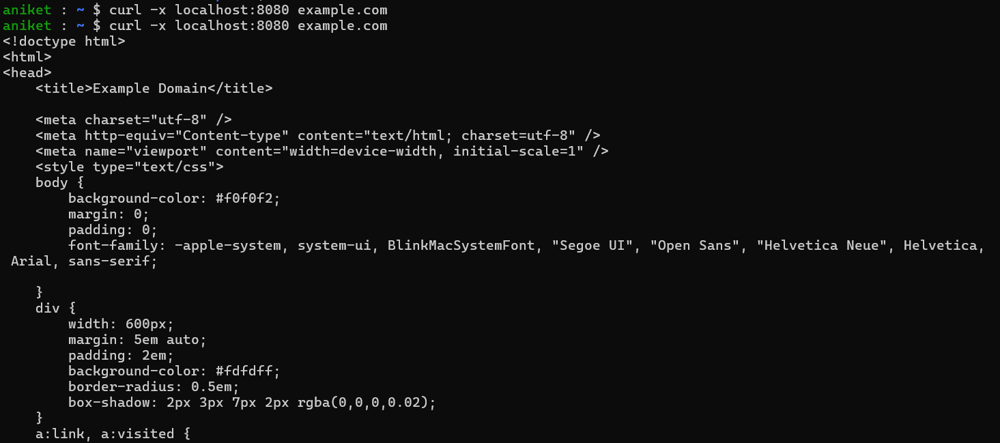
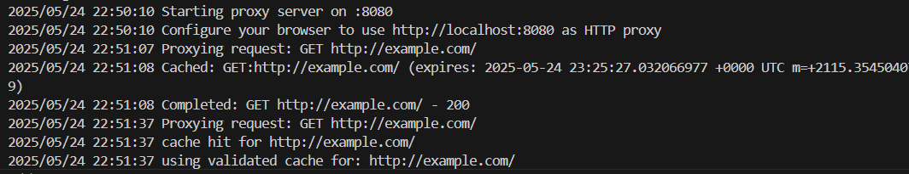

# Forward-Proxy implementation

A simple implementation of a forward proxy for HTTP requests in Go.

## Features

- HTTP proxy support
- In-memory caching
- Conditional requests (ETag, Last-Modified)

## Quick Start

1. Clone the repository:
```bash
git clone https://github.com/aniketpathak028/proxy-go.git
cd proxy-go
```

2. Run using Podman:
```bash
make podman-run
```

3. Configure your browser or use curl:
```bash
curl -x http://localhost:8080 http://example.com
```

## Project Structure

```
proxy-go/
├── cmd/
│   └── main.go        # Entry point
├── pkg/
│   ├── cache/        # Cache implementation
│   ├── proxy/        # Proxy server logic
│   └── utils/        # Helper functions
├── Dockerfile
└── Makefile
```

## Make Commands

- `make podman-build` - Build container image
- `make podman-run` - Run proxy server in container
- `make podman-clean` - Remove container image

## Configuration

Environment variables and their defaults:
- `PORT`: Default 8080
- `CONTAINER_TAG`: Default "latest"

Example with custom port:
```bash
make podman-run PORT=3000
```

## Limitations

- HTTPS proxying not supported yet (will be added in future)
- In-memory cache only (no persistence)
- Single instance only (no clustering)

## Usage




## Future Scope

- Add HTTPS support
- Implement persistent caching
- LRU cache eviction policy